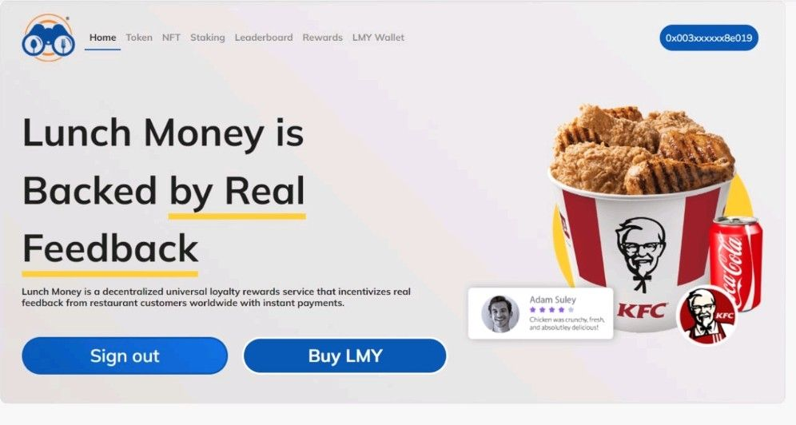
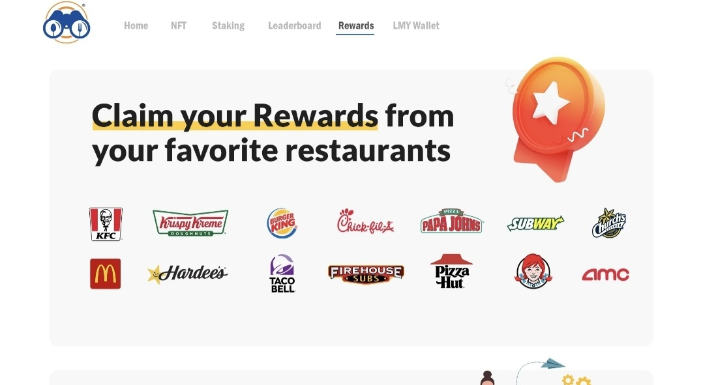

# LunchMoney is Backed by Real Feedback
LunchMoney is a decentralized loyalty rewards platform that incentivizes real feedback from restaurant customers worldwide with instant payments from the market. v2 is being built on web3 technology using Metamask and Walletlink. We welcome all devs to make contributions.

## Introduction
Lunch Money is a decentralized loyalty rewards platform that incentivizes real feedback from restaurant customers with instant payments sent from the market.

## Purpose
Our aim is to bring the gig economy to restaurants through defi.The gig economy describes a labor market where contractors and freelancers are paid according to short-term assignments and tasks, rather than full- or part-time jobs. In this case, the assignment is submitting feedback to restaurants and saving the survey code to redeem for LunchMoney tokens.

## Technical side/code area
Our native currency known as LunchMoney (LMY) is a Erc20 token used to reward restaurant customer's loyalty to their favorite restaurants. LunchMoney v2 is built web3 technology, requiring the use of a connected wallet such as Coinbase Wallet, Metamask or Walletlink to interact with the platform. Users of the platform must hold LMY in their connected wallet accounts in order to earn LMY. Users can simply purchase LMY directly on the platform through Uniswap or Indacoin. There are other options where users can purchase Lunch Money Including Dharma, Zerion or Zapperfi along with other options. Users can earn passive income simply through staking, use of leaderboard and submitting feedback to select restaurants.

### Home Page

1. Users must Sign in/Connect Wallet using Metamask, Coinbase or Walletlink to interact with the platform.
2. Users can buy LMY directly from Uniswap simply by clicking on Buy LMY.
3. Users can buy LMY directly from Indacoin using a credit card, simply click on Take Me There.

### Token Page

1. Displays all of the basic information about LMY; including smart contract address, digits ,total supply, ticker, token type and holders
2. Displays logos related to partnerships and compatible wallets

### Staking Pages
1. Users will be able to stake and unstake their LMY at anytime.
2. Users who stake, will earn a share of the total percentage of LMY staked.
3. Displays the amount of LMY staked in comparison to the total supply
4. Users must stake for a minimum of 30 days to earn.

### LMY Wallet Page (only visible to the user)

1.Shows the token balance of LMY in the connected Metamask Wallet. 

2.Users can send and receive LMY from the wallet page using their connected Metamask Wallet.

3.Chart shows LMY transaction activity and LMY price action.

4.The LMY rewards log shows feedback history and earned LMY

5.Displays an avatar representative of the user's status based on their LMY balance.  

### Leaderboard Page 

1.Users are ranked based on the LMY balance of their connected Metamask wallet.

2.User rankings change based on increases and decreases in LMY balances of the connected Metamask wallet.

### Rewards Page  

1.Uses API to recognize/verify survey validation codes.  

2.Submitted feedback reflects on the Wallet Page in the rewards history.

## About Us
LunchMoney is a product of Restaurant Private I, a private software company active in providing loyalty rewards to restaurants and customers aimed at service improvements.

## Roadmap

